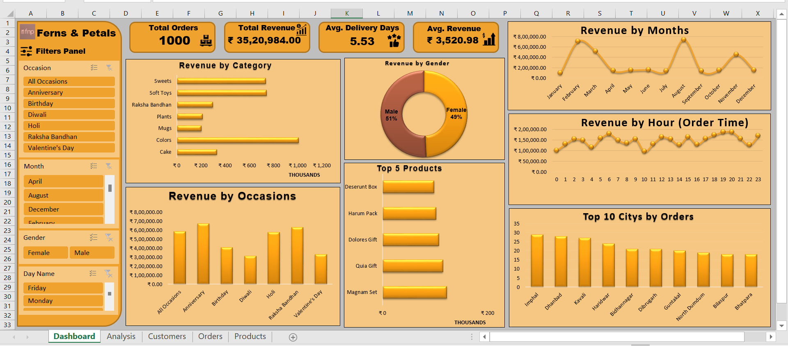

# 🌸 Ferns & Petals Sales Analysis (Excel Project)

A complete **end-to-end sales analysis project** following the **company-level data analytics process** — from **data extraction and cleaning** to **data modeling, analysis, and dashboard creation** using **Microsoft Excel**.


---

## 📘 Project Overview

The **Ferns & Petals Sales Analysis** project analyzes sales performance across **products, categories, cities, occasions, and time periods**.  
It simulates a real-world **e-commerce dataset** of Ferns & Petals (a popular gifting brand) and applies a **business intelligence workflow** to derive actionable insights for decision-making.

This project demonstrates expertise in:
- **ETL (Extract, Transform, Load)**
- **Data Modeling (Power Pivot)**
- **Pivot Table-based Analysis**
- **Dashboard Design & Visualization**

---

## 🎯 Objective

To analyze **Ferns & Petals' sales data** and uncover key insights:
- 📊 Revenue trends by **category, occasion, and month**
- 👥 Customer behavior by **gender and city**
- 💰 Top-performing **products** and **locations**
- ⏱️ Average **delivery time** and **order volume**

---

## 🧩 Project Workflow

A structured **6-step analytics process** was followed:

### 1️⃣ Data Extraction
- Imported three CSV files — **Customers**, **Orders**, and **Products** — into Excel using **Power Query**.

### 2️⃣ Data Cleaning & Transformation (ETL)
- Removed duplicates, blanks, and errors.  
- Standardized date/time formats.  
- Added new columns: `Delivery Days`, `Revenue`, `Profit Margin`.  
- Ensured correct data types and relationships.

### 3️⃣ Data Modeling (Power Pivot)
- Built a **star schema model**:
  - `Orders` → Fact Table  
  - `Customers`, `Products` → Dimension Tables  
- Linked using `Customer_ID` and `Product_ID`.

### 4️⃣ Data Analysis
- Applied **Pivot Tables** & **DAX Measures** for:
  - Total Revenue & Quantity  
  - Average Order Value  
  - Customer Segmentation  
  - Occasion-based Sales Performance

### 5️⃣ Dashboard Creation
- Designed an **interactive Excel dashboard** with KPIs, slicers, and dynamic charts.

### 6️⃣ Insights & Reporting
- Derived **business-ready insights** and actionable recommendations.

---

## 📊 Dashboard Overview



---

## 📈 Key Metrics Summary

| Metric | Value |
|:--|:--|
| **Total Orders** | 15 |
| **Unique Customers** | 99 |
| **Unique Products** | 15 |
| **Total Revenue** | ₹17,691 |
| **Average Revenue per Order** | ₹1,179 |
| **Average Delivery Days** | ~6.2 days |

---

## 💡 Data Insights

### 🏙️ Top 5 Cities by Revenue
1. Rajkot  
2. Bilaspur  
3. Jaipur  
4. Bardhaman  
5. Ambala  

### 🛍️ Top 5 Categories by Revenue
1. Colors  
2. Sweets  
3. Cake  
4. Plants  
5. Mugs  

### 🎉 Top Occasions by Revenue
1. Diwali  
2. Anniversary  
3. Birthday  
4. Valentine’s Day  
5. Holi  

### 👩‍💼 Gender-wise Insights
- **Female** customers contributed higher overall revenue.  
- **Male** customers placed more orders but with a slightly lower average order value.

---

## 🔍 Deep Insights

- 🎨 **Colors** category generated the **highest revenue**, followed by **Soft Toys** and **Sweets**.  
- 🏙️ **Imphal** and **Dhanbad** were top-performing cities by orders.  
- 💑 **Anniversary** and **Raksha Bandhan** occasions drove major revenue spikes.  
- 👩‍🦱 Gender-wise revenue is nearly balanced — **Male (51%)**, **Female (49%)**.  
- 🕒 Most orders placed during **afternoon & evening hours**.  
- 📅 **February, July, and September** recorded the highest sales peaks.

---

## 🛠 Tools & Technologies Used

| Tool | Purpose |
|------|----------|
| **Microsoft Excel** | Data Cleaning, Analysis & Dashboard Design |
| **Power Query** | Data Extraction, Cleaning & Transformation |
| **Power Pivot** | Data Modeling & Relationships |
| **Pivot Tables / DAX** | Aggregations & Business Calculations |
| **Data Visualization** | KPIs, Charts & Interactive Dashboard |

---

## 🗂 Dataset Details

| File | Description | Key Columns |
|------|--------------|-------------|
| `customers.csv` | Customer demographics and contact info | `Customer_ID`, `Name`, `City`, `Gender` |
| `products.csv` | Product details and pricing info | `Product_ID`, `Category`, `Price`, `Occasion` |
| `orders.csv` | Transactional data linking customers and products | `Order_ID`, `Customer_ID`, `Product_ID`, `Quantity`, `Order_Date`, `Delivery_Date`, `Location` |

---

## 🗂 Project Structure

```
📁 Ferns-and-Petals-Sales-Analysis/
│
├── 📁 data/
│ ├── customers.csv
│ ├── products.csv
│ └── orders.csv
│
├── 📊 Ferns_and_Petals_Sales_Analysis.xlsx
├── 🖼️ dashboard_image.png
└── 📘 README.md
```

---

## 🏁 Conclusion

This project successfully demonstrates how **Excel**, combined with **Power Query** and **Power Pivot**, enables **end-to-end business insights** through structured data analytics.  
It reflects real-world **data analytics workflows** used by organizations to monitor KPIs, identify sales trends, and optimize business performance.

> “The insights can help the company identify top-performing products, optimize delivery operations, and plan marketing campaigns for high-sales occasions.”
 
---

## 📚 Project Learnings

Through this project, I learned how to:
- Build a **complete ETL pipeline** in Excel using Power Query.  
- Design and manage **data models** using Power Pivot (Fact-Dimension relationships).  
- Implement **DAX formulas** for dynamic calculations and KPIs.  
- Create **interactive dashboards** using slicers, charts, and KPIs.  
- Translate raw data into **business stories** that support strategic decision-making.  
- Apply **professional Excel analytics workflows** similar to corporate BI projects.

---

## 🧰 Skills Demonstrated
- Data Cleaning & Transformation (ETL)  
- Business KPI & Trend Analysis  
- Data Modeling with Relationships  
- Pivot Table & DAX Measures  
- Dashboard Design & Visualization

---

## 🧑‍💻 Author

**👤 Harsh Belekar**  
📍 Data Analyst | Python | SQL | Power BI | Excel | Data Visualization  
📬 [LinkedIn](https://www.linkedin.com/in/harshbelekar) | 🔗 [GitHub](https://github.com/Harsh-Belekar)
📧 [harshbelekar74@gmail.com](mailto:harshbelekar74@gmail.com)

---

## 🏷️ Topics
Excel · Power Query · Power Pivot · Data Analysis · Dashboard · ETL · Data Modeling · Retail Analytics · Sales Insights · Business Intelligence

---

🔗 **Explore more projects:** [GitHub Profile → Harsh-Belekar](https://github.com/Harsh-Belekar)
